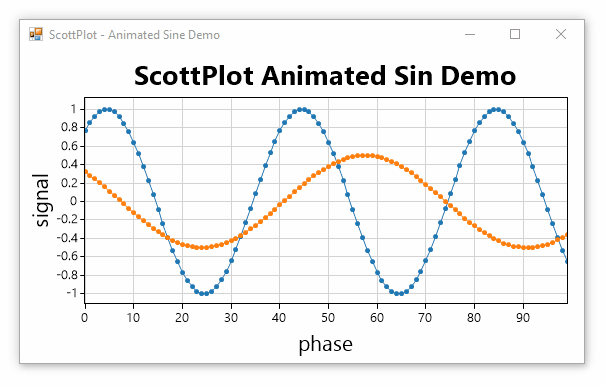

# ScottPlot

**ScottPlot is a free and open-source interactive graphing library for .NET written in C#.** 
In a GUI environment ScottPlot makes it easy to display data interactively (left-click-drag pan, right-click-drag zoom), and in non-GUI environments ScottPlot can be used to create graphs and save them as images. ScottPlot was designed to be fast enough to interactively display large datasets with millions of points at high framerates. ScottPlot is easy to integrate into .NET projects because it is [available on NuGet](https://www.nuget.org/packages/ScottPlot/) and has no dependencies outside the .NET framework libraries.


## Quickstart
1. Install ScottPlot using [NuGet](https://www.nuget.org/packages/ScottPlot/)
2. Drag/Drop the ScottPlotUC (from the toolbox) onto your Form
3. Add the following code to your startup sequence:

```cs
double[] xs = new double[] {1, 2, 3, 4, 5};
double[] ys = new double[] {1, 4, 9, 16, 25};
scottPlotUC1.plt.PlotScatter(xs, ys);
scottPlotUC1.Render();
```


## Documentation
* The **[ScottPlot Cookbook](/doc/cookbook/README.md)**
* The **[ScottPlot API](/doc/)**
* Additional quickstarts
  * [Quickstart - Windows Forms](/doc/quickstart-WinForms.md)
  * [Quickstart - WPF Application](/doc/quickstart-WPF.md)
  * [Quickstart - Console Application](/doc/quickstart-console.md)
* ScottPlot mouse actions
  * Left-click-drag to pan
  * Right-click-drag to zoom
  * Mouse scroll-wheel to zoom
  * Middle-click for auto-axis
  * Right-click for a dropdown menu
  * Double-click to display benchmark

## Compiled Demos

### ScottPlot Demo
* This demo demonstrates the display all major ScottPlot plot types. Notice that _millions_ of data points can be displayed using a Signal plot at >100 Hz framerates and comfortably interacted with using the mouse.
* Compiled demo: [ScottPlotDemo.zip](/demos/ScottPlotDemo/compiled/ScottPlotDemo.zip)
* Source code: [/demos/ScottPlotDemo/](/demos/ScottPlotDemo/)


### Animated Data
* If you plot a double array with ScottPlot, later updating the original array automatically updates the data in ScottPlot. This simple demo plots an array then uses a timer to update it continuously. Note that the graph is still mouse-interactive (panning and zooming) while continuously updating. 
* Compiled demo: [ScottPlotAnimatedSin.zip](demos/ScottPlotAnimatedSin/compiled/ScottPlotAnimatedSin.zip)
* Source code: [/demos/ScottPlotAnimatedSin/](/demos/ScottPlotAnimatedSin/)



### Audio Monitor
* This demo uses two ScottPlot plots to display audio data in real time. The signal (PCM, top) and frequency (FFT, bottom) components are continuously updated at a high framerate and are both mouse-interactive. Audio processing is provided by the [nAudio](https://github.com/naudio/NAudio) library.
* Compiled demo: [ScottPlotAudioMonitor.zip](/demos/ScottPlotAudioMonitor/compiled/ScottPlotAudioMonitor.zip)
* Source code: [/demos/ScottPlotAudioMonitor/](/demos/ScottPlotAudioMonitor/)


## Previous Versions
ScottPlot has improved in performance and simplicity over time. Changes which resulted in a change to the API were compartmentalized into major release versions. It is recommended you use the latest version of ScottPlot for new projects, but all versions can be downloaded for backward-compatibility with existing projects. Each version has its own cookbook demonstrating how to use the API.
* [ScottPlot v3](https://github.com/swharden/ScottPlot/) (May 2019 - present)
* [ScottPlot v2](https://github.com/swharden/ScottPlot/tree/2.1) (Dec 2018 - May 2019)
* [ScottPlot v1](https://github.com/swharden/ScottPlot/tree/1.0) (Jan 2018 - Dec 2018)

## About ScottPlot

ScottPlot was created by [Scott Harden](http://www.SWHarden.com/) of [Harden Technologies, LLC](http://tech.swharden.com). The author of this project may be available for the commissioned creation customized versions of this software which incorporate requested features. Inquiries may be sent to [SWHarden@gmail.com](mailto:swharden@gmail.com).
