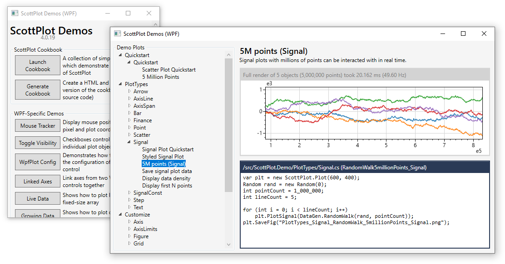

# ScottPlot :chart_with_upwards_trend:

[](https://dev.azure.com/swharden/swharden/_build/latest?definitionId=2&branchName=master)
[](https://www.nuget.org/packages/ScottPlot/)

**ScottPlot is a free and open-source graphing library for .NET** which makes it easy to display data in a variety of formats (line plots, bar charts, scatter plots, etc.) with just a few lines of code (see the **[ScottPlot Cookbook](http://swharden.com/scottplot/cookbook)** for examples). User controls are available for WinForms and WPF to allow interactive display of data. 

<div align='center'>

</div>

## Quickstart

```cs
double[] dataX = new double[] {1, 2, 3, 4, 5};
double[] dataY = new double[] {1, 4, 9, 16, 25};
var plt = new ScottPlot.Plot(600, 400);
plt.PlotScatter(dataX, dataY);
plt.SaveFig("quickstart.png");
```

* [Console Application Quickstart](http://swharden.com/scottplot/quickstart#console)
* [Windows Forms Quickstart](http://swharden.com/scottplot/quickstart#winforms)
* [WPF Quickstart](http://swharden.com/scottplot/quickstart#wpf)

More quickstarts are in [/dev/quickstart](/dev/quickstart)


## Cookbook
Review the **[ScottPlot Cookbook](http://swharden.com/scottplot/cookbook)** to see what ScottPlot can do and learn how to use most of the ScottPlot features. Every in figure in the cookbook is displayed next to the code that was used to create it. 

 <a href='http://swharden.com/scottplot/cookbooks/4.0.20/#PlotTypes_Bar_Quickstart'></a>  <a href='http://swharden.com/scottplot/cookbooks/4.0.20/#PlotTypes_Bar_MultipleBars'></a>  <a href='http://swharden.com/scottplot/cookbooks/4.0.20/#PlotTypes_Finance_CandleSkipWeekends'></a>  <a href='http://swharden.com/scottplot/cookbooks/4.0.20/#PlotTypes_Scatter_CustomizeLines'></a>  <a href='http://swharden.com/scottplot/cookbooks/4.0.20/#PlotTypes_Scatter_RandomXY'></a>  <a href='http://swharden.com/scottplot/cookbooks/4.0.20/#PlotTypes_Signal_Density'></a>  <a href='http://swharden.com/scottplot/cookbooks/4.0.20/#Customize_Axis_LogAxis'></a>  <a href='http://swharden.com/scottplot/cookbooks/4.0.20/#Customize_PlotStyle_StyledLabels'></a>  <a href='http://swharden.com/scottplot/cookbooks/4.0.20/#Customize_Ticks_LocalizedHungarian'></a>  <a href='http://swharden.com/scottplot/cookbooks/4.0.20/#Advanced_Multiplot_Quickstart'></a>  <a href='http://swharden.com/scottplot/cookbooks/4.0.20/#Examples_Stats_Histogram'></a>  <a href='http://swharden.com/scottplot/cookbooks/4.0.20/#Examples_Stats_LinReg'></a>

## ScottPlot Demo

**The [ScottPlot Demo](http://swharden.com/scottplot/demo) is a click-to-run EXE for Windows designed to make it easy to assess the capabilities of ScottPlot.** Identical demos are provided using Windows Forms and WPF to interactively display all ScottPlot Cookbook figures and also demonstrate advanced uses such as mouse tracking, displaying live data, draggable plot components.



## Build from Source
Every ScottPlot [release](https://github.com/swharden/ScottPlot/releases) is available on NuGet. However, users interested in testing features developed since the last release can do so by downloading the latest ScottPlot source code. ScottPlot is developed using the latest non-preview version of [Visual Studio Community](https://visualstudio.microsoft.com/vs/community/) (free).

> ⚠️ Inter-release source code may contain partially-implemented or experimental functionality. Installation of ScottPlot releases via NuGet or source code obtained from the [releases](https://github.com/swharden/ScottPlot/releases) page is recommended for most applications.

To use the latest ScottPlot source code in your application, download this repository and add references in your project to:

* `/src/ScottPlot/ScottPlot.csproj`

If you are creating a graphical application, also reference one of:

* `/src/ScottPlot.WPF/ScottPlot.WPF.csproj`
* `/src/ScottPlot.WinForms/ScottPlot.WinForms.csproj`


## About ScottPlot

ScottPlot was created by [Scott Harden](http://www.SWHarden.com/) ([Harden Technologies, LLC](http://tech.swharden.com)) with many contributions from the user community. Additional resources (such as version-specific cookbooks) can be found at the ScottPlot website http://swharden.com/scottplot/
